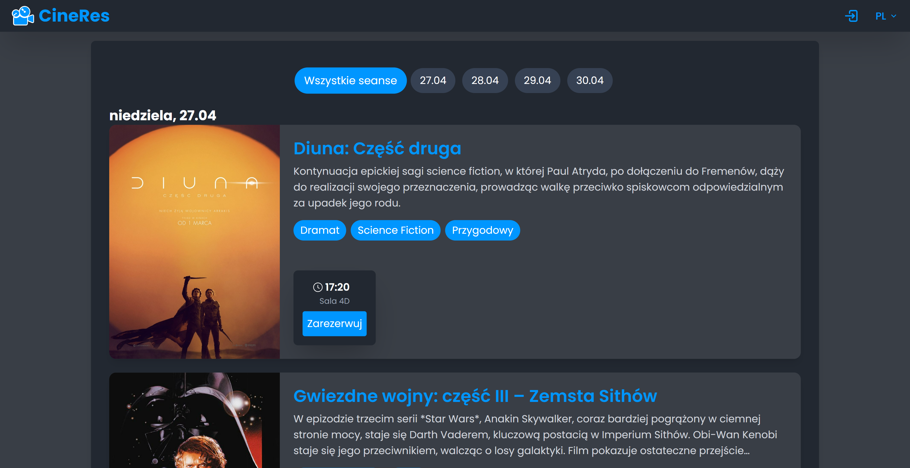
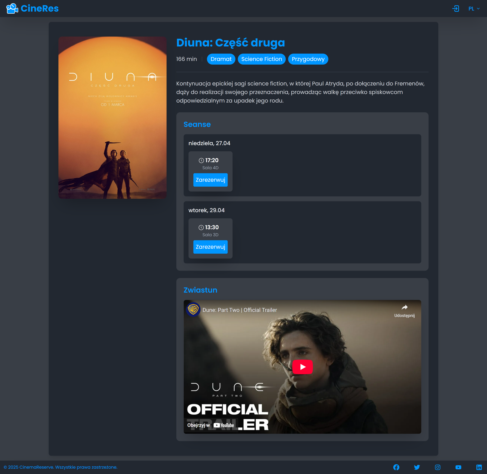
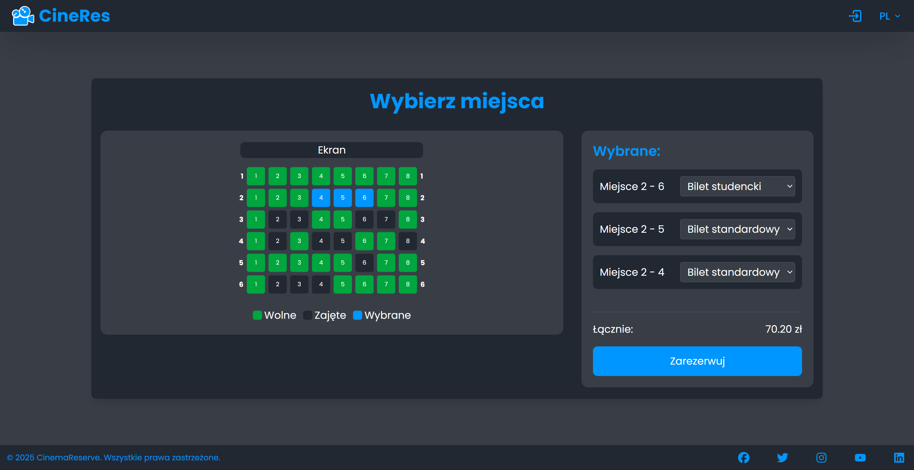
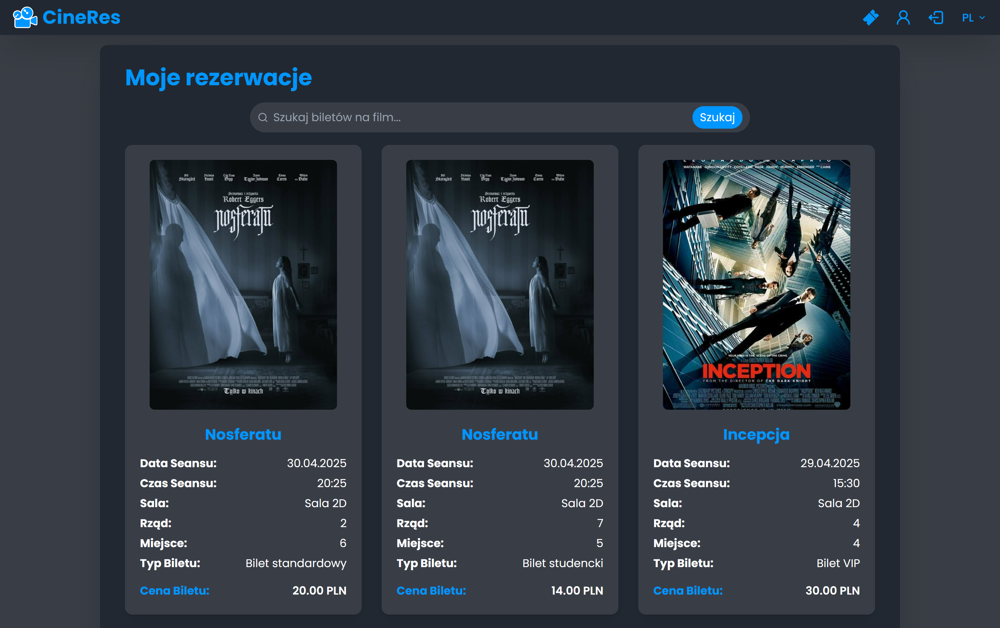
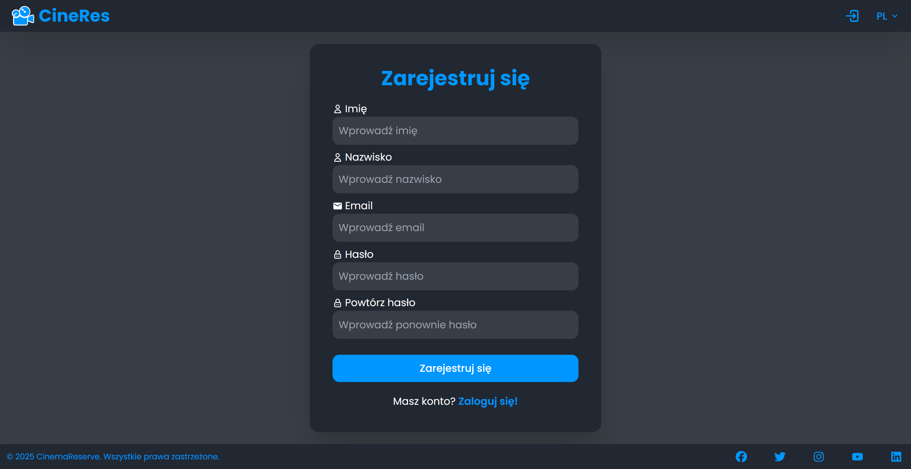
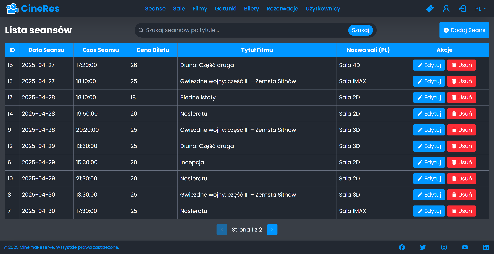
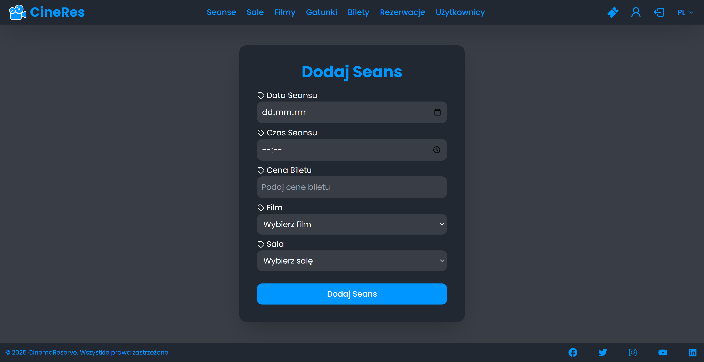

# CinemaReserve

**CinemaReserve** is a responsive web application for movie ticket reservations, developed using Java, Spring Boot, React, JavaScript, Tailwind, and PostgreSQL.

### Repositories:
- **Frontend Repository:** [Link to frontend repo](https://github.com/maciej-bartoszewski/CinemaReserve-frontend)
- **Backend Repository:** [Link to backend repo](https://github.com/maciej-bartoszewski/CinemaReserve-backend)

### Features:
- **Movie Browsing:** Explore available movies with details like description, genre, duration.
- **Showtime Listings:** Check available showtimes for each movie and select preferred screening times.
- **Ticket Booking:** Reserve movie tickets seamlessly.
- **User Authentication:** Secure registration and login system with session management.
- **Admin Panel:** Manage movies, schedules, bookings, etc.
- **Multilingual Support:** The application supports two languages for a better user experience.
- **Responsive Design:** Optimized for both desktop and mobile devices.
- **And more...**

### Validation:
- **Client-side Validation:** JavaScript provides immediate feedback on form inputs.
- **Server-side Validation:** Java validates data before storing it in the database.

### Technology Stack:
- **Frontend:** React, JavaScript, Tailwind
- **Backend:** Java, Spring Boot
- **Database:** PostgreSQL

### Screenshots
Here are some example screenshots of the application:

